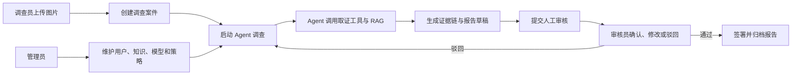

# OriginGuard 角色与权限规划

> **文档版本**：v1.1  
> **适用阶段**：OriginGuard 简历可用版本  
> **设计目标**：只保留支撑内容真实性调查闭环所必需的角色，避免为展示权限系统而过度设计。
> **最近更新**：2026-08-03  

## 版本变更

- v1.1：管理员默认不再拥有案件审核、审核驳回、报告编辑和报告终签权限；明确管理与人工裁决职责分离。
- v1.0：将原五角色方案收敛为调查员、审核员、管理员三个角色。

---

# 1. 项目主题

OriginGuard 的主题是：

> **一个由 Agent 驱动的 AIGC 内容真实性调查平台。**

系统围绕“调查案件”展开，对疑似 AIGC 生成或被局部篡改的图片执行：

```text
图片上传
→ 创建调查案件
→ 元数据与 C2PA 验证
→ AIGC 检测与篡改定位
→ RAG 检索模型说明和历史经验
→ Agent 汇总证据并生成报告草稿
→ 人工审核
→ 归档最终报告
```

角色管理只用于保证调查、审核和系统配置之间存在明确边界，不是项目的核心功能。

---

# 2. 角色规划

OriginGuard v1.0 只保留三个角色：

```text
调查员 Investigator
审核员 Reviewer
管理员 Administrator
```

原计划中的模型管理员并入管理员，独立审计员暂不实现。

---

# 3. 调查员 Investigator

## 3.1 角色定位

调查员是系统的主要使用者，负责发起和跟踪内容真实性调查。

## 3.2 核心操作

调查员可以：

- 上传待调查图片；
- 创建调查案件；
- 编辑案件基本信息；
- 启动或取消 Agent 调查任务；
- 查看元数据、C2PA、模型检测和篡改定位结果；
- 查看 Agent 调查步骤和 RAG 引用；
- 补充人工观察和证据说明；
- 将案件提交给审核员；
- 查看已完成案件和最终报告。

调查员不能：

- 签署自己创建案件的最终结论；
- 修改审核员已确认的结论；
- 发布知识库文档；
- 修改模型和 Agent 工具配置；
- 删除已经进入调查流程的原始证据。

## 3.3 主要页面

```text
/assets
/cases
/cases/new
/cases/{caseId}/workbench
/cases/{caseId}/trace
/cases/{caseId}/report
```

---

# 4. 审核员 Reviewer

## 4.1 角色定位

审核员负责 Human-in-the-loop，对 Agent 生成的调查结论进行人工确认。

## 4.2 核心操作

审核员可以：

- 查看待审核案件；
- 查看原始图片、算法结果、Agent Trace 和 RAG 引用；
- 接受或驳回某条证据；
- 确认或否定图片来源关系；
- 修改 Agent 生成的报告草稿；
- 填写最终人工结论和局限性；
- 驳回案件并要求补充调查；
- 签署和归档最终报告。

审核员不能：

- 修改原始媒体文件；
- 修改模型原始输出；
- 删除 Agent Trace；
- 管理用户和系统配置；
- 审核自己创建或主要负责调查的案件。

## 4.3 主要页面

```text
/reviews
/reviews/{reviewId}
/cases/{caseId}/workbench
/cases/{caseId}/report
```

---

# 5. 管理员 Administrator

## 5.1 角色定位

管理员负责维护系统运行所需的基础配置，不直接承担日常调查工作。

## 5.2 核心操作

管理员可以：

- 管理用户和角色；
- 管理知识文档的上传、审核和发布；
- 注册和停用模型版本；
- 维护 Model Card；
- 启用或停用 Agent 工具；
- 管理 Prompt 和安全策略版本；
- 查看系统日志、Agent Trace 和安全事件；
- 查看当前租户内全部案件，但默认不修改调查结论。

管理员默认不能：

- 审核通过或驳回案件；
- 修改审核员的人工结论；
- 编辑审核阶段的报告草稿；
- 签署或归档最终报告；
- 以管理员身份替代审核员完成 Human-in-the-loop。

如发生紧急处置，应通过显式、可审计的临时授权流程处理，不能把审核和终签能力作为管理员内置权限。

原模型管理员的职责并入管理员，包括：

```text
模型注册
模型版本配置
Model Card 管理
模型可用状态管理
模型评测结果查看
```

原审计员不再单独实现。管理员拥有系统审计查看权限，审核员拥有案件审计查看权限。

## 5.3 主要页面

```text
/admin/users
/admin/roles
/admin/knowledge
/admin/models
/admin/tools
/admin/prompts
/admin/audit
```

---

# 6. 角色与项目流程的关系



三个角色的职责可以概括为：

```text
调查员：发起并跟踪调查
Agent：自动执行调查步骤
审核员：确认最终结论
管理员：维护系统运行条件
```

---

# 7. 最小权限设计

## 7.1 权限项

```text
asset:upload
asset:read

case:create
case:read
case:update
case:submit
case:archive

agent:run
agent:cancel
agent:trace:read

review:read
review:approve
review:reject

report:read
report:edit
report:finalize

knowledge:read
knowledge:upload
knowledge:publish

model:read
model:manage

tool:read
tool:manage

audit:case:read
audit:system:read

user:manage
role:manage
```

## 7.2 权限矩阵

| 权限 | 调查员 | 审核员 | 管理员 |
|---|:---:|:---:|:---:|
| 上传媒体 | ✓ | × | × |
| 创建案件 | ✓ | × | × |
| 查看授权案件 | ✓ | ✓ | ✓ |
| 编辑调查信息 | ✓ | × | × |
| 启动 Agent | ✓ | ✓ | × |
| 查看 Agent Trace | ✓ | ✓ | ✓ |
| 提交人工审核 | ✓ | × | × |
| 审核案件 | × | ✓ | × |
| 驳回案件 | × | ✓ | × |
| 归档确认案件 | × | ✓ | × |
| 签署最终报告 | × | ✓ | × |
| 发布知识文档 | × | × | ✓ |
| 管理模型 | × | × | ✓ |
| 管理 Agent 工具 | × | × | ✓ |
| 查看案件审计 | ✓ | ✓ | ✓ |
| 查看系统审计 | × | × | ✓ |
| 管理用户和角色 | × | × | ✓ |

管理员拥有较高的配置和查看权限，但权限模型本身不授予审核和终签能力；最终结论必须由符合资源级约束的审核员完成。

---

# 8. 资源级权限规则

## 8.1 案件访问

- 调查员只能修改自己负责或被分配的案件；
- 审核员可以查看分配给自己的待审核案件；
- 管理员可以查看当前租户内全部案件；
- 管理员不能以全局查看权限替代案件审核或报告终签权限；
- 所有查询必须带租户或项目空间条件。

## 8.2 审核隔离

- 案件创建人不能签署自己的最终报告；
- 主要调查负责人不能作为唯一审核人；
- 已归档报告不能直接覆盖，只能创建新版本。

## 8.3 Agent 权限

Agent 不拥有独立管理员身份，而是继承发起用户的权限上下文。

例如：

```text
调查员启动 Agent
→ Agent 可以读取该调查员有权访问的案件
→ Agent 可以创建审核任务
→ Agent 不能发布知识文档
→ Agent 不能签署最终报告
```

## 8.4 证据保护

以下内容不能被普通角色直接删除：

- 原始媒体文件；
- 模型原始结果；
- Agent Trace；
- 已用于最终报告的证据；
- 已签署报告。

需要修正时，创建新版本或撤销标记，不直接物理覆盖。

---

# 9. 后端实现

## 9.1 基础表

```text
sys_user
sys_role
sys_permission
sys_user_role
sys_role_permission
```

## 9.2 Spring Security

后端使用：

```text
Spring Security
JWT 或安全 Cookie
RBAC
方法级权限校验
资源级权限服务
```

示例：

```java
@PreAuthorize("hasAuthority('agent:run')")
public AgentTask startInvestigation(
        Long caseId,
        CurrentUser currentUser) {

    caseAccessPolicy.checkCanOperate(caseId, currentUser);
    return agentTaskService.start(caseId, currentUser);
}
```

不能只依赖前端隐藏按钮。

## 9.3 资源权限服务

```java
public interface CaseAccessPolicy {

    void checkCanRead(Long caseId, CurrentUser user);

    void checkCanOperate(Long caseId, CurrentUser user);

    void checkCanReview(Long caseId, CurrentUser user);

    void checkCanFinalize(Long caseId, CurrentUser user);
}
```

该服务统一处理：

- 角色；
- 租户；
- 案件负责人；
- 审核人；
- 案件状态；
- 自审限制。

---

# 10. 前端实现

## 10.1 菜单

调查员：

```text
工作台
媒体资产
调查案件
我的报告
```

审核员：

```text
工作台
待审核案件
历史审核
调查报告
```

管理员：

```text
系统概览
用户与角色
知识库
模型管理
Agent 工具
Prompt 与策略
系统审计
```

## 10.2 路由守卫

前端根据权限控制页面入口，但后端仍进行最终鉴权。

```typescript
{
  path: "/reviews",
  component: () => import("@/views/reviews/index.vue"),
  meta: {
    permissions: ["review:read"]
  }
}
```

---

# 11. 核心测试

## 11.1 权限测试

必须测试：

- 调查员不能签署报告；
- 调查员不能管理模型；
- 审核员不能审核自己创建的案件；
- 审核员不能修改模型原始结果；
- 管理员能够管理用户和知识；
- 管理员调用审核、驳回或报告终签接口返回 403；
- 未授权用户访问案件返回 403；
- 跨租户访问返回 403；
- 前端隐藏按钮后，直接请求接口仍被拒绝。

## 11.2 Agent 权限测试

- Agent 继承发起人的租户；
- Agent 不能读取其他租户案件；
- Agent 不能调用未授权写工具；
- Agent 不能签署最终报告；
- Agent 创建审核任务后等待人工处理；
- 用户权限被撤销后，未完成任务停止或进入人工处理。

## 11.3 审核流程测试

```text
调查员创建案件
→ 启动 Agent
→ 生成报告草稿
→ 提交审核
→ 审核员驳回
→ 调查员补充调查
→ 再次提交
→ 审核员签署
→ 案件归档
```

同时测试：

- 重复签署；
- 并发审核；
- 已归档报告修改；
- 审核人和调查人为同一用户；
- 无证据案件提交审核。

---

# 12. 完成标准

- [ ] 系统只有调查员、审核员和管理员三个角色；
- [ ] 三个角色有明确菜单和接口权限；
- [ ] 调查员可以完成案件创建和 Agent 调查；
- [ ] 审核员可以完成驳回、确认和报告签署；
- [ ] 管理员可以管理用户、知识、模型和工具；
- [ ] 管理员默认不能审核案件或签署最终报告；
- [ ] 案件创建人不能签署自己的最终报告；
- [ ] Agent 继承用户权限，不能越权；
- [ ] 跨租户访问被后端拒绝；
- [ ] 原始证据、模型结果和 Trace 不能被普通用户覆盖；
- [ ] 权限、资源访问和审核流程均有自动化测试。

---

# 13. 角色关系总结

OriginGuard 的核心对象是调查案件，不是角色管理。

```text
调查员负责提出问题并发起调查
Agent 负责自动收集和组织证据
审核员负责最终人工判断
管理员负责保证知识、模型和系统配置可用
```

v1.0 不再增加其他角色。只有在后续出现明确业务需求时，才考虑拆分模型管理员、知识管理员或独立审计员。
